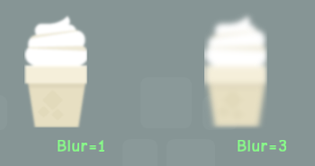

react-pixi
==========

[](https://travis-ci.org/Izzimach/react-pixi)

Create/control a [Pixi.js](https://github.com/GoodBoyDigital/pixi.js) canvas using [React](https://github.com/facebook/react).

To control a 3D scene with React, see [react-three](https://github.com/Izzimach/react-three/)



## Install Via NPM

The current version of react-pixi is `0.9.0` and uses React `15.0.0` and PIXI `4.0.0`

If you just want to use react-pixi and not build it, you can
install it using npm.

```
npm install react-pixi --save
```

At this point you can reference it using the commonjs forms.

```js
var React = require('react');
var ReactPIXI = require('react-pixi');
var PIXI = require('pixi.js');
```

It turns out that [PIXI dumps itself into the global namespace](https://github.com/pixijs/pixi.js/blob/master/src/index.js#L27) so you don't have to require it if you don't want to.

To use react-pixi with webpack, babel, and hot reloading, you can use [this boilerplate][rpb].

[rpb]: https://github.com/brigand/react-pixi-boilerplate

## Building From Source

You will need node and npm.

```
git clone https://github.com/Izzimach/react-pixi.git
cd react-pixi
npm install
npm run build
```

will build and package the code into `build/react-pixi.js`. You can include
this in your web page and reference `React`, `ReactPIXI` as globals.

```
<script src="../../build/react-pixi.js"></script>
```

NOTE that react-pixi includes its own internal copy of React (currently 15)
so you should not include the standard React library if you're doing it this way.
Doing so might give wierd results!

## Running The Examples

The examples are in `examples/` and you can view them by running a webpack dev server.

```
npm run dev
```

Then browse to `http://localhost:8080`

## Rendering Pixi.js elements

To render Pixi.js elements like a Stage or Sprite you reference them like other
components that were created with `React.createClass`.  For React 0.12 and later,
this means you have to use `React.createElement` or create factories from the
basic ReactPIXI components. For example, to construct
 a CupcakeComponent that consists of two Sprites:

```js

// set assetspath to point to your image files
var assetpath = function(filename) { return '../assets/' + filename; };

var Sprite = React.createFactory(ReactPIXI.Sprite);
var DisplayObjectContainer = React.createFactory(ReactPIXI.DisplayObjectContainer);

var CupcakeComponent = React.createClass({
  displayName: 'CupcakeComponent',
  // maps from cupcake toppings to the appropriate sprite
  spritemapping : {
    'vanilla' : assetpath('creamVanilla.png'),
    'chocolate' : assetpath('creamChoco.png'),
    'mocha' : assetpath('creamMocha.png'),
    'pink' : assetpath('creamPink.png'),
    },
  render : function () {
    var creamimagename = this.spritemapping[this.props.topping];
    var xposition = this.props.xposition;
    return DisplayObjectContainer(
      {x:xposition, y:100 },
        Sprite({image:creamimagename, y:-35, anchor: new PIXI.Point(0.5,0.5), key:'topping'}, null),
        Sprite({image:assetpath('cupCake.png'), y:35, anchor: new PIXI.Point(0.5,0.5), key:'cake'}, null)
    );
  }
});
```
(taken from the [cupcake example](examples/cupcake/cupcake.js))


Note that at the moment you need to mount onto a DOM component so your top-level component will probably be a ReactPIXI.Stage.

Look in the examples directory for more in-depth examples.

## Rendering via JSX

You can produce display elements using JSX as well. Note that you don't need
factories in this case.

```js
var assetpath = function(filename) { return '../assets/' + filename; };

var Stage = ReactPIXI.Stage;
var TilingSprite = ReactPIXI.TilingSprite;
var Text = ReactPIXI.Text;

var ExampleStage = React.createClass({
  displayName: 'ExampleStage',
  render: function() {
    var fontstyle = {font:'40px Times'};
    return <Stage width={this.props.width} height={this.props.height}>
      <TilingSprite image={assetpath('bg_castle.png')} width={this.props.width} height={this.props.height} key="1" />
      <Text text="Vector text" x={this.props.xposition} y={10} style={fontstyle} anchor={new PIXI.Point(0.5,0)} key="2" />
    </Stage>;
  }
});
```

## Testing

Testing is done with karma

```
npm run test
```

to (re)generate the pixel reference images you will need to have slimerjs installed, then

```
npm run pixelrefs
```

## Caveats

- Callbacks are just callbacks. They don't feed into React's event system.
